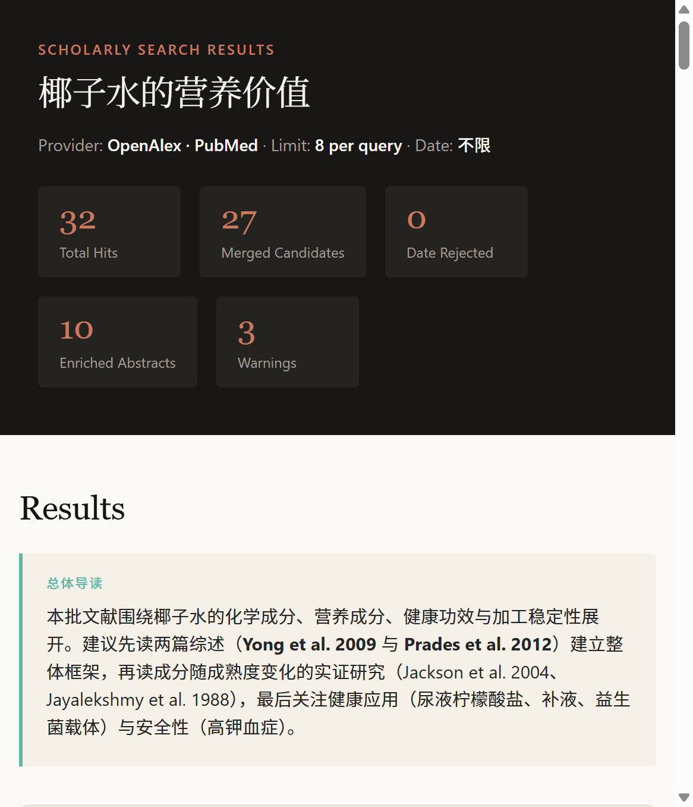
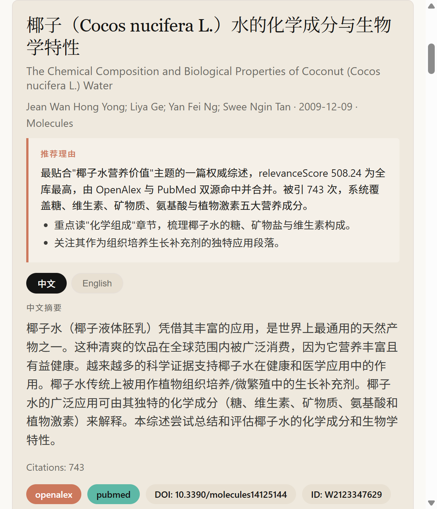

# jadense-scholar-search

[English](#english) | [中文](#中文)

---

<a id="english"></a>

## English

Provider-neutral scholarly literature search: one normalized result set from arXiv, OpenAlex, Crossref, PubMed, Semantic Scholar, and optional Google Scholar, delivered via CLI or library API.

[](https://nodejs.org)
[](https://www.typescriptlang.org)
[](LICENSE)
[](.github/workflows/ci.yml)

> **A note on language**: this package is written in English at the code level, but its result delivery is fully bilingual (Chinese + English). Titles render in both languages and abstracts switch between them via tabs, so it works equally well for Chinese- and English-speaking users.

---

### Overview

`jadense-scholar-search` abstracts a messy reality: every scholarly API returns differently shaped records, with different identity schemes, fields, and rate limits. This package normalizes all of them into one transient, predictable response --- a single list of `PaperCandidate` objects plus a query plan and provider diagnostics.

It is built for **agents and host applications** that need paper discovery, date-bounded retrieval, cross-source deduplication, or a traceable literature shortlist --- without coupling to any single vendor. It is *not* a database, a billing system, or a persistence layer; results are transient by design.

The core is deliberately **provider-neutral**: external providers plug in behind a `ProviderAdapter` interface, credentials are injected by the caller, and a failing provider never corrupts the results of the others.

### Features

- **Six providers, one interface** — arXiv, OpenAlex, Crossref, PubMed, Semantic Scholar, and optional SerpApi-backed Google Scholar, all behind a `ProviderAdapter`.
- **Query planning** — infers providers from your intent, normalizes and deduplicates up to four queries, and validates date ranges.
- **Cross-source deduplication** — merges the same paper found in multiple providers using DOI or trusted external IDs.
- **Weighted ranking** — scores candidates by relevance, citations, and recency so the best matches surface first.
- **Abstract enrichment** — `--enrich` completes missing abstracts via OpenAlex after ranking and backfills venue/URL/date/citation metadata.
- **Bilingual HTML delivery** — self-contained, zero-dependency result pages with Chinese + English titles and tabbed abstracts.
- **Failure isolation** — provider errors are captured as diagnostics and never discard successful results.
- **Offline mode** — `--offline` runs on bundled fixtures and never touches the network, perfect for tests and demos.
- **CLI + library** — a full CLI for scripting and a typed ESM API for embedding.

### Installation

```sh
npm install
```

This installs the runtime dependency (`@xmldom/xmldom`) and dev tooling (TypeScript, `tsx`, `@types/node`). Requires **Node.js >= 20**.

Build and verify:

```sh
npm run check   # tsc build + test suite
```

To install the package itself as a dependency:

```sh
npm install jadense-scholar-search
```

#### 🤖 AI-Assisted Installation

Copy and paste this prompt to your AI assistant (e.g., Cursor, GitHub Copilot, Claude, ChatGPT) to get step-by-step installation help:

```
Please help me install and set up the jadense-scholar-search package in my project.

Steps I need:
1. Check if Node.js >= 20 is installed, and install/upgrade if needed
2. Run `npm install` in the jadense-scholar-search directory
3. Run `npm run check` to verify the build and tests pass
4. Show me a quick example of how to run a basic search

If you encounter any errors, please explain them and suggest fixes.
```

> 💡 **Tip**: This prompt works well with AI coding assistants like Cursor, GitHub Copilot, Claude, and ChatGPT. Just paste it into your chat and the AI will guide you through the installation process interactively.

### Quick Start

The fastest path is the offline CLI, which uses bundled fixtures and reaches no external service:

```sh
npm run build
node dist/bin/scholar-search.mjs --offline --query "transformer interpretability"
```

For a live search across two providers, omit `--offline` and give a descriptive user agent:

```sh
node dist/bin/scholar-search.mjs \
  --query "retrieval augmented generation" \
  --provider openalex --provider crossref \
  --from 2020-01-01 --to 2025-12-31 \
  --format markdown
```

Complete missing abstracts and emit JSON:

```sh
node dist/bin/scholar-search.mjs \
  --query "coconut water composition" \
  --provider pubmed --enrich --format json
```

#### Library API

```ts
import { executeSearch } from "jadense-scholar-search"

const response = await executeSearch({
  queries: ["transformer interpretability"],
  providers: ["openalex", "arxiv"],
  limit: 10,
  dateRange: { from: "2020-01-01", to: "2025-12-31" },
}, {
  offline: false,
  runtime: {
    userAgent: "my-agent/1.0 (research@example.org)",
    contactEmail: "research@example.org",
    credentials: { serpApiKey: process.env.SERPAPI_API_KEY },
  },
})

// response.results  -> PaperCandidate[]
// response.queryPlan -> providers, limit, dateRange, hit counts
// response.diagnostics -> redacted, severity-coded
```

Enable abstract enrichment from the library:

```ts
import { executeSearch } from "jadense-scholar-search"

const response = await executeSearch(
  { queries: ["coconut water nutrition"] },
  {
    enrich: { abstract: true, topN: 8, providers: ["openalex"] },
    offline: true,
    runtime: { userAgent: "my-agent/1.0" },
  }
)
```

For a bilingual HTML result page, follow the self-contained template in `references/html-result-guide.md` and map `response.queryPlan`, `response.results`, and `response.diagnostics` into it. HTML delivery is a documented workflow, not a bundled renderer.

### Repository Structure

```
jadense-scholar-search/
├── src/                    # TypeScript source
│   ├── bin/scholar-search.mts   # CLI entry point
│   ├── providers/               # one adapter per provider + index
│   ├── enrichment.ts            # abstract completion via OpenAlex
│   ├── planning.ts              # provider inference, query normalization
│   ├── normalize.ts             # candidate identity + dedup
│   ├── search.ts                # orchestration
│   ├── errors.ts                # classified error types
│   ├── types.ts                 # public types (PaperCandidate, etc.)
│   └── index.ts                 # public exports
├── tests/                  # test suites (tsx --test tests/*.test.ts)
├── examples/               # ready-to-open sample result pages
├── references/              # delivery guides
│   ├── html-result-guide.md     # self-contained HTML template + style
│   └── translation-guide.md     # bilingual translation + reading-guide rules
├── integrations/jadense/   # downstream integration notes
├── docs/images/            # screenshots used in this README
├── .github/workflows/      # CI + release pipelines
├── dist/                   # built output (from src, gitignored for source)
├── SKILL.md                # skill/agent-facing instructions
├── README.md               # this file
├── SECURITY.md             # security policy
└── package.json            # scripts, exports, CLI metadata
```

### Configuration

#### CLI flags

| Flag | Description |
|------|-------------|
| `-q, --query <text>` | Query; repeat up to four times |
| `-p, --provider <id>` | Provider; repeat or comma-separate |
| `--limit <1..30>` | Retrieval limit per query |
| `--from / --to <YYYY-MM-DD>` | Inclusive publication date range |
| `--format <json\|markdown>` | Output format |
| `--offline` | Use fixtures, never call a provider |
| `--enrich` | Complete missing abstracts via OpenAlex after ranking |
| `--user-agent <text>` | Injected HTTP User-Agent |
| `--contact-email <email>` | Provider contact metadata |

#### Environment variables

Only **Google Scholar** requires a key. The others are optional.

| Variable | Required for | Notes |
|----------|--------------|-------|
| `SERPAPI_API_KEY` | `google_scholar` | Google Scholar is BYOK through SerpApi; never inferred without explicit intent |
| `SEMANTIC_SCHOLAR_API_KEY` | `semantic_scholar` (optional) | Raises rate limits |
| `NCBI_API_KEY` | `pubmed` (optional) | Raises rate limits |
| `NCBI_TOOL` | `pubmed` (optional) | Tool identifier for NCBI |

The CLI reads these to build the runtime. The **core itself never reads the environment** — credentials are always injected through `SearchRuntimeConfig`, keeping the library side-effect free.

### Examples

The `examples/` directory contains a real result page from a live search on **椰子水的营养价值** (nutritional value of coconut water) across OpenAlex and PubMed, then enriched and rendered with the bilingual HTML template.

Full page: the dark summary band shows the query, providers, and pipeline statistics (total hits, merged candidates, enriched abstracts, warnings).



Each paper is a card with a bilingual title, a reading-guide panel, tabbed Chinese/English abstracts, citation count, and provider badges.



Open `examples/coconut-water-nutrition-search.html` in any browser to explore the live page.

### Contributing

Contributions are welcome. This is a focused package, so please keep changes aligned with its provider-neutral philosophy.

- **Fork and branch** — open a PR against `main`.
- **Respect the boundaries** — the core must stay vendor-neutral; new providers implement `ProviderAdapter` and register in `src/providers/index.ts`.
- **Keep credentials injected** — never read environment variables inside the core.
- **Add tests** — run `npm run check` (build + `tsx --test tests/*.test.ts`). Live smoke tests must remain opt-in; use fixtures for parser tests.
- **Read `SECURITY.md`** before touching providers or logging — diagnostics must stay redacted and stable.

For a larger or long-lived project, please move this content into a dedicated `CONTRIBUTING.md`.

### License, Security & Support

- **License**: MIT — see [LICENSE](LICENSE).
- **Security**: see [SECURITY.md](SECURITY.md) for how to report suspected credential exposure, how secrets are handled, and how to use third-party APIs safely. If you execute this code, touch third-party services, or pass credentials, please read it before adding providers or logging.
- **Support**: this is a maintained open-source package. For bugs and feature requests, open an issue; for security matters, use the private reporting path in `SECURITY.md` rather than a public issue.

---

<a id="中文"></a>

## 中文

跨供应商的学术文献搜索工具：从 arXiv、OpenAlex、Crossref、PubMed、Semantic Scholar 以及可选的 Google Scholar 获取标准化的统一结果集，支持 CLI 和库 API 两种使用方式。

[](https://nodejs.org)
[](https://www.typescriptlang.org)
[](LICENSE)
[](.github/workflows/ci.yml)

> **关于语言**：本包的代码层面使用英文编写，但结果展示完全支持中英双语。标题同时显示中英文，摘要可通过标签页切换语言，中英文用户均可顺畅使用。

---

### 概述

`jadense-scholar-search` 解决了一个现实问题：每个学术 API 返回的记录格式各不同，标识方案、字段和速率限制也不一样。本包将它们全部标准化为一个可预测的响应——包含 `PaperCandidate` 对象列表、查询计划和供应商诊断信息。

本包专为**智能体和宿主应用程序**设计，适用于论文发现、日期范围检索、跨源去重或可追溯的文献候选列表等场景——且不绑定任何单一供应商。它*不是*数据库、计费系统或持久化层；结果按设计是临时性的。

核心刻意保持**供应商中立**：外部供应商通过 `ProviderAdapter` 接口接入，凭据由调用者注入，某个供应商失败不会影响其他供应商的结果。

### 功能特性

- **六大供应商，统一接口** — arXiv、OpenAlex、Crossref、PubMed、Semantic Scholar 以及可选的 SerpApi 支持的 Google Scholar，全部通过 `ProviderAdapter` 接口接入。
- **查询规划** — 根据意图推断供应商，标准化并去重最多四个查询，验证日期范围。
- **跨源去重** — 使用 DOI 或可信外部 ID 合并在多个供应商中发现的相同论文。
- **加权排序** — 按相关性、引用数和时效性评分，最佳匹配优先展示。
- **摘要补全** — `--enrich` 通过 OpenAlex 补全缺失的摘要，并回填会议/URL/日期/引用元数据。
- **双语 HTML 展示** — 自包含、零依赖的结果页面，支持中英文标题和标签式摘要切换。
- **故障隔离** — 供应商错误被捕获为诊断信息，不会丢弃成功的结果。
- **离线模式** — `--offline` 使用内置测试数据，不访问网络，适合测试和演示。
- **CLI + 库** — 完整的 CLI 用于脚本编程，类型化的 ESM API 用于嵌入集成。

### 安装

```sh
npm install
```

此命令安装运行时依赖（`@xmldom/xmldom`）和开发工具（TypeScript、`tsx`、`@types/node`）。需要 **Node.js >= 20**。

构建和验证：

```sh
npm run check   # tsc 构建 + 测试套件
```

作为依赖安装本包：

```sh
npm install jadense-scholar-search
```

#### 🤖 AI 辅助安装

复制以下提示词给你的 AI 助手（如 Cursor、GitHub Copilot、Claude、ChatGPT），获取逐步安装指导：

```
请帮我安装和配置 jadense-scholar-search 包到我的项目中。

我需要以下步骤：
1. 检查是否已安装 Node.js >= 20，如未安装或版本过低请帮我安装/升级
2. 在 jadense-scholar-search 目录下运行 `npm install`
3. 运行 `npm run check` 验证构建和测试是否通过
4. 展示一个基本搜索的快速示例

如果遇到任何错误，请解释原因并提供解决方案。
```

> 💡 **提示**：此提示词适用于 Cursor、GitHub Copilot、Claude、ChatGPT 等 AI 编程助手。只需粘贴到聊天中，AI 就会交互式地引导你完成安装过程。

### 快速开始

最快的方式是使用离线 CLI，它使用内置测试数据，不访问外部服务：

```sh
npm run build
node dist/bin/scholar-search.mjs --offline --query "transformer interpretability"
```

要进行实时搜索，省略 `--offline` 并提供描述性的用户代理：

```sh
node dist/bin/scholar-search.mjs \
  --query "retrieval augmented generation" \
  --provider openalex --provider crossref \
  --from 2020-01-01 --to 2025-12-31 \
  --format markdown
```

补全缺失摘要并输出 JSON：

```sh
node dist/bin/scholar-search.mjs \
  --query "coconut water composition" \
  --provider pubmed --enrich --format json
```

#### 库 API

```ts
import { executeSearch } from "jadense-scholar-search"

const response = await executeSearch({
  queries: ["transformer interpretability"],
  providers: ["openalex", "arxiv"],
  limit: 10,
  dateRange: { from: "2020-01-01", to: "2025-12-31" },
}, {
  offline: false,
  runtime: {
    userAgent: "my-agent/1.0 (research@example.org)",
    contactEmail: "research@example.org",
    credentials: { serpApiKey: process.env.SERPAPI_API_KEY },
  },
})

// response.results  -> PaperCandidate[]
// response.queryPlan -> 供应商、限制、日期范围、命中计数
// response.diagnostics -> 脱敏的、按严重性分级的诊断信息
```

从库中启用摘要补全：

```ts
import { executeSearch } from "jadense-scholar-search"

const response = await executeSearch(
  { queries: ["coconut water nutrition"] },
  {
    enrich: { abstract: true, topN: 8, providers: ["openalex"] },
    offline: true,
    runtime: { userAgent: "my-agent/1.0" },
  }
)
```

要获取双语 HTML 结果页面，请参考 `references/html-result-guide.md` 中的自包含模板，将 `response.queryPlan`、`response.results` 和 `response.diagnostics` 映射进去。HTML 展示是一个文档化的工作流程，而非内置的渲染器。

### 仓库结构

```
jadense-scholar-search/
├── src/                    # TypeScript 源代码
│   ├── bin/scholar-search.mts   # CLI 入口点
│   ├── providers/               # 每个供应商一个适配器 + 索引
│   ├── enrichment.ts            # 通过 OpenAlex 补全摘要
│   ├── planning.ts              # 供应商推断、查询标准化
│   ├── normalize.ts             # 候选者标识 + 去重
│   ├── search.ts                # 编排
│   ├── errors.ts                # 分类错误类型
│   ├── types.ts                 # 公共类型（PaperCandidate 等）
│   └── index.ts                 # 公共导出
├── tests/                  # 测试套件（tsx --test tests/*.test.ts）
├── examples/               # 可直接打开的示例结果页面
├── references/              # 展示指南
│   ├── html-result-guide.md     # 自包含 HTML 模板 + 样式
│   └── translation-guide.md     # 双语翻译 + 阅读指南规则
├── integrations/jadense/   # 下游集成说明
├── docs/images/            # 本 README 中使用的截图
├── .github/workflows/      # CI + 发布流水线
├── dist/                   # 构建输出（来自 src，源码版本控制中忽略）
├── SKILL.md                # 技能/智能体指令
├── README.md               # 本文件
├── SECURITY.md             # 安全策略
└── package.json            # 脚本、导出、CLI 元数据
```

### 配置

#### CLI 参数

| 参数 | 描述 |
|------|------|
| `-q, --query <text>` | 查询；最多重复四次 |
| `-p, --provider <id>` | 供应商；重复或逗号分隔 |
| `--limit <1..30>` | 每个查询的检索限制 |
| `--from / --to <YYYY-MM-DD>` | 包含性的发布日期范围 |
| `--format <json\|markdown>` | 输出格式 |
| `--offline` | 使用测试数据，不调用供应商 |
| `--enrich` | 排序后通过 OpenAlex 补全缺失摘要 |
| `--user-agent <text>` | 注入的 HTTP User-Agent |
| `--contact-email <email>` | 供应商联系元数据 |

#### 环境变量

只有 **Google Scholar** 需要密钥。其他是可选的。

| 变量 | 用途 | 备注 |
|------|------|------|
| `SERPAPI_API_KEY` | `google_scholar` | Google Scholar 通过 SerpApi 使用自带密钥；无明确意图不会自动推断 |
| `SEMANTIC_SCHOLAR_API_KEY` | `semantic_scholar`（可选） | 提高速率限制 |
| `NCBI_API_KEY` | `pubmed`（可选） | 提高速率限制 |
| `NCBI_TOOL` | `pubmed`（可选） | NCBI 工具标识符 |

CLI 读取这些变量来构建运行时。**核心本身从不读取环境变量**——凭据始终通过 `SearchRuntimeConfig` 注入，保持库的无副作用特性。

### 示例

`examples/` 目录包含一个真实的搜索结果页面，展示了在 OpenAlex 和 PubMed 上搜索**椰子水的营养价值**的结果，经过摘要补全并使用双语 HTML 模板渲染。

完整页面：深色摘要栏显示查询、供应商和流水线统计（总命中数、合并后的候选者、已补全摘要、警告）。


每篇论文是一个卡片，包含双语标题、阅读指南面板、可切换的中英文摘要、引用计数和供应商徽章。


在任何浏览器中打开 `examples/coconut-water-nutrition-search.html` 即可查看实际页面。

### 贡献

欢迎贡献。这是一个专注的包，请保持更改与其供应商中立的哲学一致。

- **Fork 和分支** — 向 `main` 发起 PR。
- **尊重边界** — 核心必须保持供应商中立；新供应商实现 `ProviderAdapter` 并在 `src/providers/index.ts` 中注册。
- **保持凭据注入** — 永远不要在核心内部读取环境变量。
- **添加测试** — 运行 `npm run check`（构建 + `tsx --test tests/*.test.ts`）。实时冒烟测试必须保持可选；解析器测试使用测试数据。
- **阅读 `SECURITY.md`** 再处理供应商或日志——诊断信息必须保持脱敏和稳定。

对于更大或长期维护的项目，请将此内容移至专门的 `CONTRIBUTING.md`。

### 许可证、安全与支持

- **许可证**：MIT — 参见 [LICENSE](LICENSE)。
- **安全**：参见 [SECURITY.md](SECURITY.md) 了解如何报告疑似凭据泄露、密钥处理方式以及如何安全使用第三方 API。如果你执行此代码、接触第三方服务或传递凭据，请在添加供应商或日志之前阅读它。
- **支持**：这是一个维护中的开源包。对于 bug 和功能请求，请提交 issue；对于安全问题，请使用 `SECURITY.md` 中的私人报告路径，而非公开 issue。
